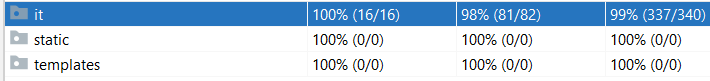
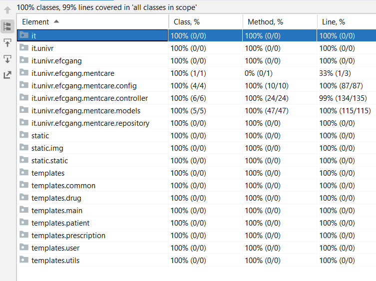
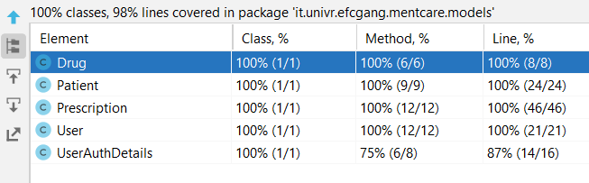

# Fondamenti di Ingegneria del Software 
# Progetto finale a.a. 2021 / 2022

Fabiola Fabretti VR482924    
Elisa Zanella VR482140    
Cesare Montresor VR481252    

#### Table of Contents

- [Informazioni sul progetto](#informazioni-sul-progetto)  
- [Processo di sviluppo](#processo-di-sviluppo)  
- [Requisiti](#Requisiti)  
- [Scenarios](#scenarios)    
    -   1 [Login](#1-login)  
    -   2 [Inserisci paziente](#2-inserisci-paziente)  
    -   3 [Elimina paziente](#3-elimina-paziente)  
    -   4 [Modifica paziente](#4-modifica-paziente)  
    -   5 [Visualizza lista pazienti](#5-visualizza-lista-pazienti)  
    -   6 [Inserisci prescrizione farmaco](#6-inserisci-prescrizione-farmaco)  
    -   7 [Elimina prescrizione farmaco](#7-elimina-prescrizione-farmaco)  
    -   8 [Modifica prescrizione farmaco](#8-modifica-prescrizione-farmaco)  
    -   9 [Visualizza lista prescrizioni farmaco](#9-visualizza-lista-prescrizioni-farmaco) 
- [Quality assurance](#quality-assurance)
  - [Test selection](#test-selection)
  - [Unit testing](#unit-testing)
  - [End-to-end testing](#end-to-end-testing)     
    -   1 [Login](#1-login-1)  
    -   2 [Inserisci paziente](#2-inserisci-paziente-1)  
    -   3 [Elimina paziente](#4-elimina-paziente)  
    -   4 [Modifica paziente](#3-modifica-paziente)  
    -   5 [Visualizza lista pazienti](#5-visualizza-lista-pazienti-1)  
    -   6 [Inserisci prescrizione farmaco](#6-inserisci-prescrizione-farmaco-1)  
    -   7 [Elimina prescrizione farmaco](#8-elimina-prescrizione-farmaco)  
    -   8 [Modifica prescrizione farmaco](#7-modifica-prescrizione-farmaco)  
    -   9 [Visualizza lista prescrizioni farmaco](#9-visualizza-lista-prescrizioni-farmaci)  
    -   [extra](#extra)

## Informazioni sul progetto

Il progetto è stato sviluppato con il linguaggio Java nella versione 11, invece come supporto per la gestione delle dipendenze abbiamo utilizzato Gradle con versione 7.3.1 e come IDE IntelliJ. Abbiamo usato un'architettura MVC, usando il framework Java Spring e Springboot (+ moduli Thymeleaf e security), con un database h2 che è stata necessaria per gestire la creazione dei dati.

Il testing utilizza selenium, junit 4.12 e "bonigarcia webdrivermanager".

Per effettuare la generazione automatica di alcune parti codice ci siamo serviti della libreria lombok nella versione 1.18.12. In particolare essa è stata utilizzata per generare automaticamente i metodi getter e setter dei campi nelle classi del package model.
## Processo di sviluppo

Il processo di sviluppo si è svolto principalmente in maniera informale, pur cercando di applicare qualcuna delle tecniche viste in classe. In particolare, siamo rimasti più vicini all’agile durante lo sviluppo vero e proprio, mentre a inizio progetto abbiamo deciso di dedicare del tempo alla scelta della traccia, alla programmazione a grandi linee del lavoro e soprattutto alla stima dell’effort necessario allo sviluppo di ciascuna feature.

Questo ci ha anche permesso di dividere il lavoro in modo equo: inizialmente abbiamo deciso di scrivere insieme il codice per definire le interfacce tra moduli e il mapping degli indirizzi, per poi continuare a sviluppare parallelamente un modulo a testa (Patient, Prescription, Main/Login/Security) con frequenti riunioni di aggiornamento sulla situazione di ciascun componente del gruppo.

Per lavorare simultaneamente abbiamo usato GitHub, con tre fork separate (ispirandoci al modello forking workflow), in modo da poter avere massima flessibilità e indipendenza durante l'intero processo.

Il coordinamento e aggiornamento è avvenuto principalmente via chat e chiamate attraverso la piattaforma Discord.

## Requisiti

Mentcare é un sistema informativo per la gestione di informazioni di pazienti con problemi di salute mentale in cura presso una clinica.

Il sistema ha due obiettivi:

- generare informazioni riguardanti i pazienti che consentono ai responsabili di prescrivere dei farmaci per poterli curare;
- fornire l'accesso a queste informazioni alle diverse tipologie di utenti;

Il sistema dispone di:

- un database centrale;
- l'accesso da host remoti, da cui è possibile effettuare diverse operazioni in base alla tipologia di utente che accede.

Il sistema necessita dell'implementazione delle seguenti funzionalità:

- memorizzare le informazioni relative ai pazienti e di poterle visualizzare 
- registrare le prescrizioni di farmaci ai pazienti e di poterle visualizzare
- premettere agli utenti di accedere a queste informazioni a seconda della tipologia di utente che effettua il login

Inoltre il sistema presuppone che le password degli utenti non siano salvate in chiaro all'interno della base di dati per evitare che l'amministratore di sistema possa modificarle.

Gli utenti di tale sistema sono:
- Guest: l'ospite può solamente visualizzare le informazioni relative al proprio profilo;
- Admin: amministratore dell'intero sistema che può gestire le informazioni degli utenti;
- Doctor: ovvero i dottori possono gestire le informazioni dei pazienti e anche di gestire il lato delle loro prescrizioni;
- Office: quindi il personale amministrativo che si occupa gestione delle informazioni dei pazienti; 

Si ricorda inoltre che tutti gli utenti possono visualizzare le informazioni relative al proprio profilo.

## Scenarios

Gli seguenti scenari sono volti a soddisfare i requisiti appena esplicitati.
Essi sono stati suddivisi in 3 macro categorie:
1. gestione dell'accesso (login)
2. gestione dei pazienti
3. gestione delle prescrizioni 

### 1. Login

Per tutti i casi successivi a questo, si supporrà che l’utente abbia già effettuato il login.

|                                | Descrizione                                           |
| ------------------------------ | ----------------------------------------------------- |
| **Initial assumption**         | L’utente si è appena collegato al sito e non è loggato.                                                                                                                                                                                                                                                      |
| **Normal function**            | L’utente si collega al sito e compare una schermata che richiede nome utente e password. L’utente inserisce le proprie credenziali e preme invio, per poi essere reindirizzato alla homepage del sito. La homepage ed il relativi menù sono personalizzati sulla base del livello di accesso dell’utente. |
| **What can go wrong**          | Se l’utente inserisce le credenziali errate, la pagina si aggiorna senza concedere l’accesso all’utente.                                                                                                                                                                                                     |
| **Other activities**           | -                                                                                                                                                                                                                                                                                                            |
| **System state on completion** | L’utente viene loggato, menu e moduli riflettono il livello di accesso dell’utente.                                                                                                                                                                                                                          |

### 2. Inserisci paziente

|                                | Descrizione                                           |
| ------------------------------ | ----------------------------------------------------- |
| **Initial assumption**         | L’utente è loggato come medico.   |
| **Normal function**            | L’utente clicca sul pulsante “Patient” nella barra menu superiore per accedere al modulo relativo ai pazienti.Successivamente, clicca sul pulsante “New patient”. Viene visualizzato un form dove impostare il nome del nuovo paziente, e un menù a tendina da cui selezionare il medico curante fra quelli iscritti nel sistema. Infine, l’utente preme il pulsante “Create patient” ed è reindirizzato alla pagina dei pazienti. |
| **What can go wrong**          | Se l’utente non compila il campo del nome del paziente, al click del tasto di salvataggio i nuovi dati non vengono inseriti nel database, ma viene caricata nuovamente la pagina di creazione paziente con aggiunto un messaggio relativo all’errore riscontrato.  |
| **Other activities**           | Se l’utente clicca su “Go back to list” anziché salvare le modifiche, il database non viene modificato e la “bozza” viene persa.   |
| **System state on completion** | Il paziente viene aggiunto al database.       |

### 3. Elimina paziente

|                                | Descrizione                                           |
| ------------------------------ | ----------------------------------------------------- |
| **Initial assumption**         | L’utente è loggato come medico.                                                                                                                                                                                                                                                                                                          |
| **Normal function**            | L’utente clicca sul pulsante “Patient” nella barra menu superiore per accedere al modulo relativo ai pazienti.Successivamente, individua la riga relativa al paziente che vuole eliminare, e clicca sul pulsante “Delete” presente nella riga. La pagina si ricarica automaticamente per mostrare la nuova lista dei pazienti a sistema. |
| **What can go wrong**          | Non è possibile che succeda attraverso la GUI, ma se l’utente dovesse cercare di forzare l’eliminazione di una paziente inserendo l'id direttamente nell’URL, il sistema rileva il tentativo e mostra un messaggio di errore.    |
| **Other activities**           | -         |
| **System state on completion** | Il paziente viene eliminato dal database.                                                                                                                                                                                                                                                                                                |

### 4. Modifica paziente

|                                | Descrizione                                           |
| ------------------------------ | ----------------------------------------------------- |
| **Initial assumption**         | L’utente è loggato come medico.                          |
| **Normal function**            | L’utente clicca sul pulsante “Patient” nella barra menu superiore per accedere al modulo relativo ai pazienti, dove individua il paziente che vuole modificare e clicca sul pulsante “Edit” relativo. Viene visualizzato un form analogo a quello della Create ma precompilato con i dati del paziente che si sta modificando. Infine, l’utente preme il pulsante “Confirm changes” ed è reindirizzato alla pagina dei pazienti. |
| **What can go wrong**          | Se l’utente lascia vuoto il campo del nome, al click del tasto di salvataggio i nuovi dati non vengono inseriti nel database, ma viene caricata nuovamente la pagina di edit paziente con aggiunto un messaggio relativo agli errori riscontrati e i dati originariamente presenti nel database.  |
| **Other activities**           | Se l’utente clicca su “Go back to list” anziché salvare le modifiche, il database non viene modificato e la “bozza” viene persa.  |
| **System state on completion** | La versione originale del paziente viene eliminata e sostituita con la nuova.   |

### 5. Visualizza lista pazienti

|                                | Descrizione                                           |
| ------------------------------ | ----------------------------------------------------- |
| **Initial assumption**         | L’utente è loggato come medico.                                                                         |
| **Normal function**            | L’utente clicca sul menu “Patient” nel menu principale, e viene reindirizzato alla pagina dei pazienti. |
| **What can go wrong**          | -                                                                                                       |
| **Other activities**           | -                                                                                                       |
| **System state on completion** | -                                                                                                       |

### 6. Inserisci prescrizione farmaco

|                                | Descrizione                                           |
| ------------------------------ | ----------------------------------------------------- |
| **Initial assumption**     | L’utente è loggato come medico.     |
| **Normal function**        | L’utente clicca sul pulsante “Prescriptions” nella barra menu superiore per accedere al modulo relativo alle prescrizioni.Successivamente, clicca sul pulsante “Create new prescription”. Viene visualizzato un form dove scegliere paziente e medicinale, scrivere il dosaggio a parole e impostare la data di inizio e fine di validità della prescrizione. Infine, l’utente preme il pulsante “Create prescription” ed è reindirizzato alla pagina delle prescrizioni. |
| **What can go wrong**      | Se l’utente non compila il campo del dosaggio o sceglie una data di inizio successiva alla data di fine, al click del tasto di salvataggio i nuovi dati non vengono inseriti nel database, ma viene caricata nuovamente la pagina di creazione prescrizione con aggiunto un messaggio relativo agli errori riscontrati.  |
| **Other activities**       | Se l’utente clicca su “Go back to list” anziché salvare le modifiche, il database non viene modificato e la “bozza” viene persa.    |
| System state on completion | La prescrizione viene aggiunta al database.   |

### 7. Elimina prescrizione farmaco

|                                | Descrizione                                           |
| ------------------------------ | ----------------------------------------------------- |
| **Initial assumption**         | L’utente è loggato come medico.    |
| **Normal function**            | L’utente clicca sul pulsante “Prescriptions” nella barra menu superiore per accedere al modulo relativo alle prescrizioni.Successivamente, individua la riga relativa alla prescrizione che vuole eliminare, e clicca sul pulsante “Delete” presente nella riga. La pagina si ricarica automaticamente per mostrare la nuova lista delle prescrizioni a sistema. |
| **What can go wrong**          | -  |
| **Other activities**           | Non è possibile che succeda attraverso la GUI, ma se l’utente dovesse cercare di forzare l’eliminazione di una prescrizione inserendo l'id direttamente nell’URL, il sistema rileva il tentativo e mostra un messaggio di errore.    |
| **System state on completion** | La prescrizione viene eliminata dal database. |

### 8. Modifica prescrizione farmaco

|                                | Descrizione                                           |
| ------------------------------ | ----------------------------------------------------- |
| **Initial assumption**         | L’utente è loggato come medico.                       |
| **Normal function**            | L’utente clicca sul pulsante “Prescriptions” nella barra menu superiore per accedere al modulo relativo alle prescrizioni, dove individua la prescrizione che vuole modificare e clicca sul pulsante “Edit” relativo. Viene visualizzato un form analogo a quello della Create ma precompilato con i dati della prescrizione che si sta modificando, per selezionare paziente e medicinale, scrivere il dosaggio a parole e impostare la data di inizio e fine di validità della prescrizione. Infine, l’utente preme il pulsante “Create prescription” ed è reindirizzato alla pagina delle prescrizioni. |
| **What can go wrong**          | Se l’utente non compila il campo del dosaggio o sceglie una data di inizio successiva alla data di fine, al click del tasto di salvataggio i nuovi dati non vengono inseriti nel database, ma viene caricata nuovamente la pagina di edit prescrizione con aggiunto un messaggio relativo agli errori riscontrati e i dati originariamente presenti nel database.   |
| **Other activities**           | Se l’utente clicca su “Go back to list” anziché salvare le modifiche, il database non viene modificato e la “bozza” viene persa.  |
| **System state on completion** | La versione originale della prescrizione viene eliminata e sostituita con la nuova prescrizione.    |

### 9. Visualizza lista prescrizioni farmaco

|                                | Descrizione                                           |
| ------------------------------ | ----------------------------------------------------- |
| **Initial assumption**         | L’utente è loggato come medico.                       |
| **Normal function**            | L’utente clicca sul pulsante “Prescriptions” nella barra menu superiore per accedere al modulo relativo alle prescrizioni, e viene visualizzata una tabella con tutte quelle memorizzate nel sistema. |
| **What can go wrong**          | -                                                     |
| **Other activities**           | -                                                     |
| **System state on completion** | -                                                     |

## Quality assurance

Per quanto riguarda la quality assurance, ci siamo affidati principalmente alla scrittura di test automatizzati con JUnit e occasionalmente alla revisione informale del codice scritto, cercando di fare refactoring e migliorare la qualità del codice periodicamente.

I **60** tests scritti sono divisi in due categorie:

- **Unit test** (package `unit`)  
  Sono test sui singoli model presenti nel sistema.

- **Tests end to end** (package `ui`)  
  Sono test che interagiscono con il sistema attraverso l'interfaccia, usando Selenium.
  In particolare questi test hanno avuto lo scopo di garantire il corretto funzionamento dell'applicativo, oltre garantire la code coverage delle classi presenti all'interno del package controller.

Non abbiamo fatto del testing esplicito per quanto riguarda l’interazione fra i componenti, in quanto non abbiamo fatto interagire i models fra loro e l’interazione fra model, view e controller è gestita da Spring MVC.

## Test selection

I tests selezionati hanno sia l’obiettivo di simulare il comportamento reale dell’applicazione, con l’inserimento di dati realistici, sia quello di testare condizioni errate e inserimenti non validi. Abbiamo inserito almeno un test per ciascuno di queste due classi di input.

Infine, pur non essendo esplicitamente collegati agli scenari scelti e dunque agli acceptance test, abbiamo inserito anche qualche test relativo alle pagine aggiuntive durante lo sviluppo - come ad esempio la visualizzazione delle medicine disponibili o degli utenti registrati nel sistema.

## Unit testing

Gli unit test si sono concentrati sui model, e in particolare sulla verifica del funzionamento della logica interna di Patient e Prescription - dato che verificano internamente la validità dell’istanza.
Tali test sono stati fatti su tutti i metodi presenti nelle classi compresi anche i costruttori, getter e setter.

## End to end testing

Di seguito riportiamo, per ciascuno scenario descritto in precedenza, gli E2E test relativi e una descrizione delle operazioni svolte.

### 1. Login

Class Reference: [MainControllerTest] 

[MainControllerTest]: https://github.com/cesare-montresor/mentcare/blob/main/src/test/java/it/univr/efcgang/mentcare/ui/MainControllerTest.java#L21

| Nome del test        | Descrizione                                                                                                            |
| -------------------- | ---------------------------------------------------------------------------------------------------------------------- |
| **[testLogin]**        | Effettua il login.                                                                                                     |
| **[testLoginProfile]** | Effettua il login. Accede al profilo e verifica le informazioni dell’utente                                            |
| **[testLoginDoctor]**  | Effettua il login con un utente di livello DOCTOR. Verifica che il menu mostri i moduli per il ruolo DOCTOR.       |
| **[testLoginAdmin]**   | Effettua il login con un utente di livello ADMIN. Verifica che il menu mostri i moduli per il ruolo ADMIN.         |
| **[testLoginOffice]**  | Effettua il login con un utente di livello OFFICE. Verifica che il menu mostri i moduli per il ruolo OFFICE.       |
| **[testError404]**     | Effettua il login. Tenta di accedere ad una risorsa inesistente.                                                       |
| **[testError403]**     | Effettua il login con un utente di livello DOCTOR. Tenta di accedere ad una risorsa che appartiene al ruolo ADMIN. |
| **[testErrorNot]**     | Effettua il login, accede alla pagina di errore direttamente.                                                          |

[testLogin]: https://github.com/cesare-montresor/mentcare/blob/main/src/test/java/it/univr/efcgang/mentcare/ui/MainControllerTest.java#L24
[testLoginProfile]: https://github.com/cesare-montresor/mentcare/blob/main/src/test/java/it/univr/efcgang/mentcare/ui/MainControllerTest.java#L33
[testLoginDoctor]: https://github.com/cesare-montresor/mentcare/blob/main/src/test/java/it/univr/efcgang/mentcare/ui/MainControllerTest.java#L52
[testLoginAdmin]: https://github.com/cesare-montresor/mentcare/blob/main/src/test/java/it/univr/efcgang/mentcare/ui/MainControllerTest.java#L66
[testLoginOffice]: https://github.com/cesare-montresor/mentcare/blob/main/src/test/java/it/univr/efcgang/mentcare/ui/MainControllerTest.java#L80
[testError404]: https://github.com/cesare-montresor/mentcare/blob/main/src/test/java/it/univr/efcgang/mentcare/ui/MainControllerTest.java#L94
[testError403]: https://github.com/cesare-montresor/mentcare/blob/main/src/test/java/it/univr/efcgang/mentcare/ui/MainControllerTest.java#L105
[testErrorNot]: https://github.com/cesare-montresor/mentcare/blob/main/src/test/java/it/univr/efcgang/mentcare/ui/MainControllerTest.java#L116

### 2. Inserisci paziente

Class Reference: [PatientControllerTest] 

[PatientControllerTest]: https://github.com/cesare-montresor/mentcare/blob/main/src/test/java/it/univr/efcgang/mentcare/ui/PatientControllerTest.java#L8

| Nome del test                   | Descrizione                                                                                                     |
| ------------------------------- | --------------------------------------------------------------------------------------------------------------- |
| **[testCreatePatient]**           | Aggiunge un nuovo paziente e verifica che la lista dei pazienti sia stata aggiornata di conseguenza.            |
| **[testCreatePatientWrongInput]** | Tenta di aggiungere un nuovo paziente con un dato non accettabile (nome del paziente vuoto) e verifica che venga visualizzato un messaggio di errore in alto alla pagina di creazione del paziente. |

[testCreatePatient]: https://github.com/cesare-montresor/mentcare/blob/main/src/test/java/it/univr/efcgang/mentcare/ui/PatientControllerTest.java#L32
[testCreatePatientWrongInput]: https://github.com/cesare-montresor/mentcare/blob/main/src/test/java/it/univr/efcgang/mentcare/ui/PatientControllerTest.java#L50

### 3. Modifica paziente

Class Reference: [PatientControllerTest] 

[PatientControllerTest]: https://github.com/cesare-montresor/mentcare/blob/main/src/test/java/it/univr/efcgang/mentcare/ui/PatientControllerTest.java#L8

| Nome del test                   | Descrizione                                                             |
| ------------------------------- | ----------------------------------------------------------------------- |
| **[testEditPatientWrongInput]**   | Tenta di modificare un paziente esistente con un dato non accettabile (nome del paziente vuoto) e verifica che venga visualizzato il relativo messaggio di errore. |
| **[testEditPatient]**             | Modifica i dati di un paziente e verifica che la entry della tabella relativa a quel paziente sia aggiornata di conseguenza. |
| **[testEditPatientNotFound]**     | Tenta di modificare un paziente con id non esistente inserendo l'id nello url della pagina e verifica che venga visualizzato una pagina di errore che dice che il paziente non è stato trovato solo che a differenza di testUpdatePatientWrongInput l'utente visualizza una pagina di errore diversa da edit perchè la pagina di modifica di quel paziente non esiste per questo viene mostrata la pagina notfound. |

[testEditPatientWrongInput]: https://github.com/cesare-montresor/mentcare/blob/main/src/test/java/it/univr/efcgang/mentcare/ui/PatientControllerTest.java#L63
[testEditPatient]: https://github.com/cesare-montresor/mentcare/blob/main/src/test/java/it/univr/efcgang/mentcare/ui/PatientControllerTest.java#L82
[testEditPatientNotFound]: https://github.com/cesare-montresor/mentcare/blob/main/src/test/java/it/univr/efcgang/mentcare/ui/PatientControllerTest.java#L106

### 4. Elimina paziente

Class Reference: [PatientControllerTest] 

[PatientControllerTest]: https://github.com/cesare-montresor/mentcare/blob/main/src/test/java/it/univr/efcgang/mentcare/ui/PatientControllerTest.java#L8

| Nome del test                 | Descrizione                                                                                          |
| ----------------------------- | ---------------------------------------------------------------------------------------------------- |
| **[testDeletePatient]**         | Elimina un paziente e verifica che la lista di pazienti sia aggiornata di conseguenza.             |
| **[testDeletePatientNotFound]** | Tenta di eliminare un paziente inserendo da url l'id di un paziente non esistente e verifica che venga visualizzata la relativa pagina di errore che dice che il paziente non è stato trovato. |

[testDeletePatient]: https://github.com/cesare-montresor/mentcare/blob/main/src/test/java/it/univr/efcgang/mentcare/ui/PatientControllerTest.java#L133
[testDeletePatientNotFound]: https://github.com/cesare-montresor/mentcare/blob/main/src/test/java/it/univr/efcgang/mentcare/ui/PatientControllerTest.java#L149

### 5. Visualizza lista pazienti

Class Reference: [PatientControllerTest] 

[PatientControllerTest]: https://github.com/cesare-montresor/mentcare/blob/main/src/test/java/it/univr/efcgang/mentcare/ui/PatientControllerTest.java#L8

| Nome del test              | Descrizione                                                                                |
| -------------------------- | ------------------------------------------------------------------------------------------ |
| **[testInitListPatients]** | Verifica che la lista dei pazienti sia inizializzata correttamente con i dati in DemoData. |

[testInitListPatients]: https://github.com/cesare-montresor/mentcare/blob/main/src/test/java/it/univr/efcgang/mentcare/ui/PatientControllerTest.java#L15

### 6. Inserisci prescrizione farmaco

Class Reference: [PrescriptionControllerTest] 

[PrescriptionControllerTest]: https://github.com/cesare-montresor/mentcare/blob/main/src/test/java/it/univr/efcgang/mentcare/ui/PrescriptionControllerTest.java#L16

| Nome del test                        | Descrizione                                                                          |
| ------------------------------------ | ------------------------------------------------------------------------------------ |
| **[testAddPrescription]**            | Aggiunge una nuova prescription e verifica che la tabella sia stata aggiornata di conseguenza. |
| **[testAddPrescriptionWrongDate]**   | Tenta di aggiungere una nuova prescription con un dato non accettabile (data di fine validità antecedente alla data di inizio validità) e verifica che venga visualizzato un messaggio di errore. |
| **[testAddPrescriptionWrongDosage]** | Tenta di aggiungere una nuova prescription con un dato non accettabile (campo di testo che descrive il dosaggio vuoto) e verifica che venga visualizzato un messaggio di errore. |

[testAddPrescription]: https://github.com/cesare-montresor/mentcare/blob/main/src/test/java/it/univr/efcgang/mentcare/ui/PrescriptionControllerTest.java#L85
[testAddPrescriptionWrongDate]: https://github.com/cesare-montresor/mentcare/blob/main/src/test/java/it/univr/efcgang/mentcare/ui/PrescriptionControllerTest.java#L136
[testAddPrescriptionWrongDosage]: https://github.com/cesare-montresor/mentcare/blob/main/src/test/java/it/univr/efcgang/mentcare/ui/PrescriptionControllerTest.java#L159

### 7. Modifica prescrizione farmaco

Class Reference: [PrescriptionControllerTest] 

[PrescriptionControllerTest]: https://github.com/cesare-montresor/mentcare/blob/main/src/test/java/it/univr/efcgang/mentcare/ui/PrescriptionControllerTest.java#L16

| Nome del test                       | Descrizione                                                                             |
| ----------------------------------- | ------------------------------------------------------------------------------------------ |
| **[testEditPrescription]**            | Modifica la prima prescription della tabella e verifica sia che la prescription in modifica sia pre compilata correttamente nel modulo, sia che a fine procedura risulti aggiornata di conseguenza      |
| **[testEditPrescriptionWrongDate]**   | Tenta di modificare la prima prescription della tabella con dei dati non accettabili (data di fine validità antecedente alla data di inizio validità) e verifica che venga visualizzato un messaggio di errore. |
| **[testEditPrescriptionWrongDosage]** | Tenta di modificare la prima prescription della tabella con dei dati non accettabili (campo di testo che descrive il dosaggio vuoto) e verifica che venga visualizzato un messaggio di errore.  |

[testEditPrescription]: https://github.com/cesare-montresor/mentcare/blob/main/src/test/java/it/univr/efcgang/mentcare/ui/PrescriptionControllerTest.java#L185
[testEditPrescriptionWrongDate]: https://github.com/cesare-montresor/mentcare/blob/main/src/test/java/it/univr/efcgang/mentcare/ui/PrescriptionControllerTest.java#L221
[testEditPrescriptionWrongDosage]: https://github.com/cesare-montresor/mentcare/blob/main/src/test/java/it/univr/efcgang/mentcare/ui/PrescriptionControllerTest.java#L241

### 8. Elimina prescrizione farmaco

Class Reference: [PrescriptionControllerTest] 

[PrescriptionControllerTest]: https://github.com/cesare-montresor/mentcare/blob/main/src/test/java/it/univr/efcgang/mentcare/ui/PrescriptionControllerTest.java#L16

| Nome del test                 | Descrizione                                                                              |
| ----------------------------- | ---------------------------------------------------------------------------------------- |
| **[testDeletePrescription]**    | Elimina la prima prescription della tabella delle prescrizioni e verifica che la tabella sia stata aggiornata di conseguenza. |
| **[testDeletePrescription404]** | Tenta di forzare l’eliminazione di una entry non esistente, e verifica che il sistema reagisca reindirizzando l'utente a una pagina di errore. |

[testDeletePrescription]: https://github.com/cesare-montresor/mentcare/blob/main/src/test/java/it/univr/efcgang/mentcare/ui/PrescriptionControllerTest.java#L55
[testDeletePrescription404]: https://github.com/cesare-montresor/mentcare/blob/main/src/test/java/it/univr/efcgang/mentcare/ui/PrescriptionControllerTest.java#L72

### 9. Visualizza lista prescrizioni farmaci

Class Reference: [PrescriptionControllerTest] 

[PrescriptionControllerTest]: https://github.com/cesare-montresor/mentcare/blob/main/src/test/java/it/univr/efcgang/mentcare/ui/PrescriptionControllerTest.java#L16

|  Nome del test           | Descrizione                                                                                                        |
| ------------------------ | ------------------------------------------------------------------------------------------------------------------ |
| **[testTableInitState]** | Verifica che la tabella delle prescription sia visualizzata correttamente con le informazioni di prova (DemoData). |

[testTableInitState]: https://github.com/cesare-montresor/mentcare/blob/main/src/test/java/it/univr/efcgang/mentcare/ui/PrescriptionControllerTest.java#L19

## Extra

| Nome del test           | Descrizione                                                                                                          |
| ----------------------- | -------------------------------------------------------------------------------------------------------------------- |
| **[testDrugViewInit]**  | Verifica che la tabella con l’elenco dei medicinali sia inizializzata correttamente e visibile a un DOCTOR o OFFICE. |
| **[testDBStats]**       | Verifica che il conteggio delle entry nel database siainizializzato correttamente e visibile a un ADMIN.             |
| **[testUsersViewInit]** | Verifica che la tabella con l’elenco degli utenti registrati siainizializzata correttamente e visibile a un ADMIN.   |

[testDrugViewInit]: https://github.com/cesare-montresor/mentcare/blob/main/src/test/java/it/univr/efcgang/mentcare/ui/DrugControllerTest.java#L20
[testDBStats]: https://github.com/cesare-montresor/mentcare/blob/main/src/test/java/it/univr/efcgang/mentcare/ui/UtilsControllerTest.java#L13
[testUsersViewInit]: https://github.com/cesare-montresor/mentcare/blob/main/src/test/java/it/univr/efcgang/mentcare/ui/UserControllerTest.java#L16

### Code coverage

Abbiamo verificato la code coverage dei nostri tests attraverso il tool integrato in IntelliJ. In generale, avviando sia unit che e2e test, raggiungiamo una code coverage del 99%:

Nello specifico, la parte sugli unit test raggiunge una copertura del 98% sulle classi relative ai models.

### Informazioni aggiuntive 

Per garantire una maggior sicurezza nella memorizzazione delle password degli utenti è stato necessario memorizzarne l'hash usando BCrypt.

La grafica delle pagine è stata arricchita con elementi presi dalla libreria bootstrap.
